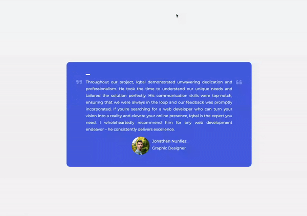

# Testimonial Box Switcher

The **Testimonial Box Switcher** is a simple yet effective project that allows users to view a rotating selection of testimonials. It provides a user-friendly interface where testimonials are displayed along with the name, position, text, and photo of the person giving the testimonial. Testimonials automatically switch every 10 seconds, creating a dynamic and engaging user experience.

[Deployed link here](https://iqbalahmadi.github.io/Testimonial-Box-Switcher/)

## Demo

## Features

- Rotating testimonials: Testimonials automatically switch every 10 seconds to keep the content fresh and engaging.
- Responsive design: The project is responsive and works seamlessly on various screen sizes and devices.
- Attractive visuals: Testimonials are displayed with photos from [Unsplash](Unsplash.com), enhancing the visual appeal.
- Easy to customize: You can easily customize the testimonials, text, and styles to match your brand or project's requirements.

## Technologies

The Testimonial Box Switcher is built using the following technologies:

- HTML: Structuring the content.
  CSS: Styling and layout.
- JavaScript: Implementing the testimonial rotation functionality.
- Font Awesome: Icons for a visually appealing design.
- Unsplash: Source for high-quality photos used in testimonials.
